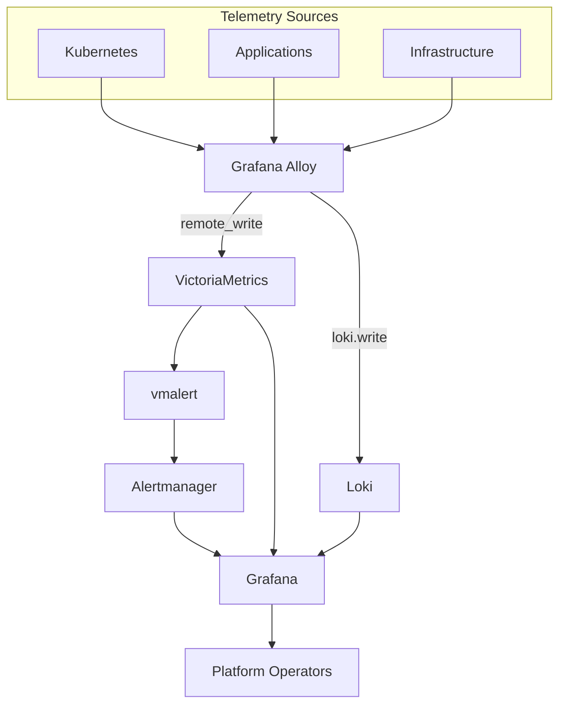
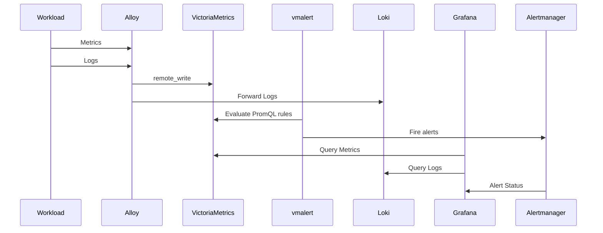

# ADR 0007: Observability Stack

## Status

Accepted

## Context

The platform requires a unified observability solution capable of:

- Infrastructure and Kubernetes metrics collection, storage, and querying
- Centralized log aggregation
- Alert rule evaluation and notification routing
- A single visualization surface for metrics, logs, and alerts
- Low operational overhead on a single-node cluster
- Strong security defaults for the collection layer

This ADR covers stack/component selection only. Persistence strategy (ephemeral vs.
NAS-backed) is a temporary, revisitable state tied to the current lack of a dynamic
StorageClass in this cluster — it applies equally regardless of which metrics/log
backend is chosen, so it does not factor into this decision and is not covered here.
Network policy scope for the observability namespaces is likewise a separate concern.
Both are tracked outside this ADR (`docs/planning/plan.md`, `docs/planning/backlog.md`,
future ADRs as needed).

## Decision

Adopt the following observability stack:

| Capability | Component |
| --- | --- |
| Metrics storage & querying | VictoriaMetrics (single-node) |
| Alert rule evaluation | vmalert |
| Alert routing & notification | Alertmanager |
| Log aggregation | Loki |
| Metrics + log collection | Grafana Alloy |
| Dashboards & visualization | Grafana |

**No Prometheus Operator, no VictoriaMetrics Operator, no CRD-based service
discovery.** Alloy performs Kubernetes service/pod discovery and scraping natively
(`discovery.kubernetes` + `prometheus.scrape` for metrics, the same pattern already
used for logs), writing metrics to VictoriaMetrics via `prometheus.remote_write` and
logs to Loki via `loki.write`. This is a deliberate choice, not an oversight: it's the
only way to actually deliver on "fewer platform controllers, simpler operational
model" — an operator + CRDs (Prometheus's or VictoriaMetrics's own
`victoria-metrics-k8s-stack`) would reintroduce the same class of problem either way
(a CRD that other cluster components depend on existing before it's installed).

## Architecture

### Data Flow

## Component Selection

### VictoriaMetrics

VictoriaMetrics (single-node mode) is the metrics storage and query backend.

- Prometheus-compatible query language (PromQL) and remote-write ingestion
- Lower memory and CPU footprint than Prometheus at this scale
- No sidecar operator, no CRDs — storage/query only, collection is Alloy's job

### vmalert

VictoriaMetrics's storage component does not evaluate alerting rules — that's a
separate concern in this ecosystem (unlike Prometheus, which bundles scraping, storage,
and rule evaluation into one binary). `vmalert` evaluates PromQL-based alerting rules
against VictoriaMetrics and forwards firing alerts to Alertmanager. Without it, alert
rules would never fire — VictoriaMetrics alone only answers queries.

### Alertmanager

Unchanged responsibility from the wider Prometheus ecosystem: alert grouping,
deduplication, silencing, and notification routing. Consumes alerts from `vmalert`
rather than from Prometheus's own rule evaluator.

### Loki

Centralized log aggregation, Kubernetes-focused, native Grafana integration.

### Grafana Alloy

Single collection agent for both metrics and logs:

- Kubernetes API-based discovery and log streaming (`loki.source.kubernetes`) — no
  privileged host filesystem access required for routine log collection
- Native Prometheus-style scrape components (`discovery.kubernetes` +
  `prometheus.scrape`) for metrics, forwarded via `prometheus.remote_write`
- One agent, one configuration language, for both signal types — avoids running a
  second scraper (e.g. `vmagent`) alongside it

### Grafana

Single visualization surface across VictoriaMetrics (metrics), Loki (logs), and
Alertmanager (alert status).

## Rationale

### Operational Simplicity

Every component has one job: Alloy collects, VictoriaMetrics stores metrics, Loki
stores logs, vmalert evaluates rules, Alertmanager routes, Grafana presents. No
operator/CRD layer sits between "chart installed" and "data flowing" — removes an
entire class of Kubernetes bootstrap-ordering problem (a CRD-consuming resource
syncing before the CRD-providing chart has run) that a bundled operator-based stack
would otherwise introduce on this ArgoCD sync-wave setup.

### Security

- Alloy collects Kubernetes logs via the Kubernetes API — no privileged securityContext
  or hostPath mount needed for routine log collection.
- Fewer platform controllers (no Prometheus Operator, no VM Operator) means fewer
  cluster-scoped RBAC grants and less code running with elevated permissions.

### Resource Efficiency

VictoriaMetrics's lower footprint than Prometheus, combined with not running a
separate operator/CRD-reconciliation controller, keeps the observability platform's
own resource draw modest relative to the single node it shares with every other
workload.

## Consequences

### Positive

- Lower resource consumption than an operator-based Prometheus stack
- No CRD-based cross-component bootstrap ordering to reason about
- Single collection agent (Alloy) for both metrics and logs
- PromQL and Prometheus remote-write compatibility preserved — existing
  Prometheus-ecosystem knowledge and most community dashboards still apply

### Negative

- No ServiceMonitor/PodMonitor-style declarative CRDs — every scrape target needs an
  explicit Alloy discovery/relabel rule instead of a small CR dropped in a chart's own
  namespace. More upfront config per new component that exposes metrics.
- Smaller ecosystem and fewer off-the-shelf examples than Prometheus Operator-based
  deployments.
- `vmalert` is an additional moving part not obviously implied by "swap Prometheus for
  VictoriaMetrics" — must be remembered and deployed explicitly, as documented above.

## Review Criteria

This decision should be revisited if:

- Observability requirements outgrow single-node VictoriaMetrics (would need
  `victoria-metrics-k8s-stack`/cluster mode, reintroducing operator/CRD tradeoffs)
- Advanced distributed tracing becomes a platform requirement
- The volume of manually-written Alloy scrape/discovery rules becomes harder to
  maintain than adopting CRD-based service discovery would be
