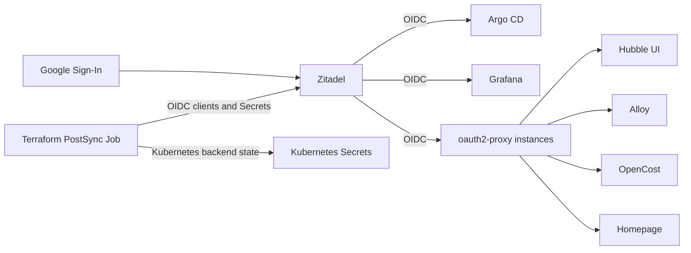

# ADR 0008: Zitadel Identity and OIDC

## Status

Accepted

## Context

The homelab needs one identity provider for browser sign-in to its administrative
and observability UIs, plus an external identity option for the single human
operator. The cluster is a single-node Talos installation managed by Argo CD;
the design should keep identity configuration declarative and avoid a separate
database or manual client-secret synchronization where practical.

The existing applications have mixed OIDC support. Argo CD and Grafana support
OIDC directly; Hubble UI, Alloy, OpenCost, and Homepage do not. The Google OAuth
console also rejects `.local` callback URLs, while internal services should not
be exposed on the public internet merely to obtain a publicly trusted TLS
certificate.

## Decision

Use **Zitadel** as the homelab identity provider, with Google Sign-In enabled
through Zitadel's instance and organization login policies. Keep identity
provider configuration and OIDC clients declarative in Terraform stored with
the Zitadel application manifests.

- Configure native OIDC in Argo CD and Grafana.
- Put an app-specific `oauth2-proxy` in front of Hubble UI, Alloy, OpenCost, and
  Homepage. Terminate their public-facing browser sessions at the proxy and
  keep their upstream services cluster-internal.
- Use `id.hl.mkoelle.com` as Zitadel's issuer and OAuth callback domain. Issue
  the `*.hl.mkoelle.com` certificate with cert-manager and Route 53 DNS-01.
  DNS-01 publishes only temporary ACME TXT records; it does not publish public
  A records for homelab services.
- Override `hl.mkoelle.com` resolution inside the cluster with CoreDNS so
  `id.hl.mkoelle.com` resolves to the Gateway's LAN LoadBalancer IP. The
  hostname remains unreachable from public DNS while browsers and in-cluster
  clients can use a publicly trusted certificate.
- Reconcile the Zitadel project, OIDC applications, login policies, and
  resulting Kubernetes Secrets using a Terraform PostSync Job. Store Terraform
  state in the Kubernetes backend in the Zitadel namespace rather than
  introducing an external state service.

## Architecture

The Terraform Job waits for Zitadel health before applying. Its `.tf` inputs
are generated into a content-hashed ConfigMap, and the Argo CD hook is replaced
when those inputs change. Zitadel-generated OIDC credentials are written
directly to the Kubernetes Secrets consumed by each client/proxy, avoiding a
second manual or Bitwarden copy of generated client secrets. Long-lived
operator-managed credentials and application secrets continue to come from
Bitwarden Secrets Manager via External Secrets Operator.

## Rationale

- **One identity control plane:** Zitadel provides OIDC and Google federation;
  the former Authelia setup did not provide the external identity-provider
  flow this homelab needed.
- **Declarative client lifecycle:** Terraform makes client registration,
  callback URLs, policies, and Kubernetes Secret material reproducible rather
  than dependent on console clicks or hand-copied secrets.
- **Mixed application support:** native OIDC avoids a proxy where supported;
  `oauth2-proxy` supplies a consistent OIDC front door for apps without native
  support.
- **Publicly trusted TLS without public service exposure:** DNS-01 proves
  domain control without publishing service addresses, and the internal DNS
  override keeps the issuer usable from the LAN and cluster.
- **Single-node fit:** the in-cluster Terraform backend avoids another service
  and is acceptable for this single-admin homelab, while making backup of
  Zitadel's database and Kubernetes state especially important.

## Consequences

### Positive

- One Zitadel session covers the supported administrative and observability
  UIs, including Google sign-in.
- OAuth client configuration and generated secrets are reconciled together.
- Internal UIs can use a real TLS certificate without public A records or
  inbound internet access.

### Negative and risks

- Zitadel becomes a critical dependency and a single point of failure for
  browser sign-in. Its Postgres database, Zitadel masterkey, Terraform state,
  and recovery credentials need reliable backups.
- The Terraform PostSync Job, Zitadel provider, Kubernetes backend, and
  generated Secrets add moving parts to identity reconciliation. A failed
  apply can leave clients temporarily out of sync.
- Each proxied application needs its own OIDC client, proxy deployment,
  callback configuration, Gateway route, and network-policy rules.
- Filebrowser is not currently behind Zitadel; it remains a tracked
  authentication gap rather than being treated as covered by this decision.
- The Route 53 credentials and DNS-01 account are additional sensitive
  dependencies; the IAM user should remain scoped to the relevant hosted zone.
- The in-cluster Terraform state is not an independent backup. Cluster loss
  requires recovery from the external backups for the IdP and its secrets.

## Implementation References

- `apps/core/zitadel/` — Zitadel, Postgres, certificates, and Terraform Job
- `apps/core/zitadel/terraform/` — provider configuration and OIDC resources
- `apps/core/coredns-custom/configmap.yaml` — LAN-only DNS override
- `apps/core/gateway/` — Gateway listeners and public wildcard certificate
- `apps/core/cilium/`, `apps/core/alloy/`, `apps/core/homepage/`, and
  `apps/core/opencost/` — oauth2-proxy deployments and routes
- `apps/core/argocd/argocd-cm.yaml` and
  `apps/core/monitoring/values-grafana.yaml` — native OIDC clients

## Review Criteria

Revisit this decision if the cluster gains multiple human users, remote/public
access becomes a requirement, the Zitadel recovery/backup burden becomes
unacceptable, or a simpler identity provider offers the required Google
federation and OIDC support with lower operational cost.
